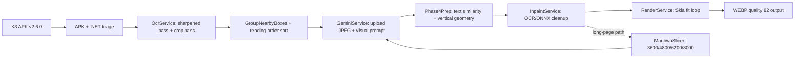

# K3 Manga AutoTranslate Mobile v2.6.0 reverse-engineering report

> Analysis date: 2026-09-24
> Analyst: Sisyphus / local authorized workspace
> Toolchain: `jadx` 1.5.6, `apktool` 2.7.0-dirty, managed-assembly decompilation, `sha256sum`, `rg`, XML parser, Git diff checks
> Report flavor: `null` (ordinary APK/.NET reverse-engineering task; no malware or vulnerability claim)

## 1. Executive summary

K3 Manga AutoTranslate Mobile v2.6.0 is a .NET MAUI Android application whose translation path is image-grounded rather than a local text-only LLM path. Static reconstruction shows a quality-oriented flow: repeated ML Kit OCR passes, image upload to Gemini, geometric/text matching back to source regions, inpainting, and Skia typesetting to WebP. The most useful Houri adaptations are stable region IDs for deterministic response assignment, Gemini page-image context, flat-bubble fast cleanup before neural inpainting, and pre-downscale long-page slicing. The requested changes were implemented in the wrapper and native engine, but remain uncommitted and were not built by the agent because Gradle execution was explicitly prohibited. The user reported one native compile error; the `maxOf` import was corrected from `kotlin.math` to `kotlin.comparisons`, and the user should rerun the existing compile task to confirm the full build.

## 2. Scope and authorization

The case scope is recorded in [scope.md](../scope.md).

| Field | Value |
|---|---|
| Case | `k3-mtl-apk` |
| Authorization | `granted`, basis `written_contract` |
| Network profile | `authorized_target_only` |
| In-scope asset | Public GitHub release APK for Kthree-K3/K3-Manga-AutoTranslate-Mobile |
| Out of scope | DOS, phishing real users, unrestricted exfiltration |
| Deliverables | Static reverse engineering, Houri adaptation, report, field journal, diagram |

The analysis stayed within the named public release and the local Houri source tree. No credentials, tokens, cookies, or real user data were retained in the report.

## 3. Evidence chain

### E-001 — APK identity

- **source_ref:** `apk/K3Manga.AutoTranslate.v2.6.0.apk`
- **content_hash:** `a09274ad5273d5fe2faaea5f0d4a67ca803c6bf94f43362471f7d7c96aa55541`
- **artifact_path:** `apk/K3Manga.AutoTranslate.v2.6.0.apk`
- **repro_command:**

```bash
sha256sum work/k3-mtl-apk/apk/K3Manga.AutoTranslate.v2.6.0.apk
file work/k3-mtl-apk/apk/K3Manga.AutoTranslate.v2.6.0.apk
```

- **observation:** The public v2.6.0 artifact is 133177934 bytes and identifies package `com.k3.manga.autotranslate`.
- status: observed

### E-002 — Recovered managed assembly and symbols

- **source_ref:** `analysis/dotnet/K3_Manga_AutoTranslate_Mobile.dll`
- **content_hash:** `a2832cddcb2a8150f456a57082c2aea89f10e238b712177d2623a7374c9deaad`
- **artifact_path:** `analysis/dotnet/K3_Manga_AutoTranslate_Mobile.dll`
- **repro_command:**

```bash
sha256sum work/k3-mtl-apk/analysis/dotnet/K3_Manga_AutoTranslate_Mobile.dll
sha256sum work/k3-mtl-apk/analysis/dotnet/K3_Manga_AutoTranslate_Mobile.pdb
file work/k3-mtl-apk/analysis/dotnet/K3_Manga_AutoTranslate_Mobile.dll
```

- **observation:** The APK contains a readable managed .NET assembly and a matching Roslyn PDB. Decompilation was readable without de4dot.
- status: observed

### E-003 — K3 translation and rendering call path

- **source_ref:** `analysis/dotnet/decompiled/MangaTranslatorMobile/Services/Phase4PrepService.cs`
- **content_hash:** `241b2cc70b10064c92aebb9265f6532cc09337ef958483a5b09968549ac2fbbc`
- **artifact_path:** `analysis/dotnet/decompiled/MangaTranslatorMobile/Services/Phase4PrepService.cs`
- **repro_command:**

```bash
rg -n "CalculateSimilarity|AreBlocksVerticallyAligned|PreparePhase4Async|FaText|CleanSingle" \
  work/k3-mtl-apk/analysis/dotnet/decompiled/MangaTranslatorMobile/Services/Phase4PrepService.cs
rg -n "UploadFileToGeminiAsync|BuildGeminiPayload|fileData|streamGenerateContent" \
  work/k3-mtl-apk/analysis/dotnet/decompiled/MangaTranslatorMobile/Services/GeminiService.cs
```

- **observation:** K3 performs multiple OCR passes, groups nearby boxes, matches Gemini records to OCR blocks using text similarity and vertical alignment, filters censored records, expands render boxes, invokes inpainting, and renders WebP output. `GeminiService` uploads JPEGs and places image file data in the Gemini request; translation is not local text-only inference.
- status: observed

### E-004 — K3 long-page slicing

- **source_ref:** `analysis/dotnet/decompiled/MangaTranslatorMobile/Services/ManhwaSlicerService.cs`
- **content_hash:** `1d8d97387563b635f77ce478947a7aaff824627055ee361329d29cea714f6001`
- **artifact_path:** `analysis/dotnet/decompiled/MangaTranslatorMobile/Services/ManhwaSlicerService.cs`
- **repro_command:**

```bash
rg -n "MIN_SLICE_HEIGHT|TARGET_SLICE_HEIGHT|MAX_SEARCH_HEIGHT|HARD_MAX_HEIGHT|MIN_GUTTER_BAND_HEIGHT|FindSafeGutterCutY|FindLowestEnergyCutY|OUTPUT_QUALITY" \
  work/k3-mtl-apk/analysis/dotnet/decompiled/MangaTranslatorMobile/Services/ManhwaSlicerService.cs
```

- **observation:** The slicer uses a 3600px minimum, 4800px target, 6200px search ceiling, 8000px hard ceiling, and 55px minimum clean-gutter band. It scores clean rows around the target, falls back to low-energy cuts, and emits WebP slices at quality 78.
- status: observed

### E-005 — Houri quality adaptation

- **source_ref:** `yakuyomi-engine/src/main/kotlin/exh/yakuyomi/LongPageSlicer.kt` and the external engine `Inpainter.kt`
- **content_hash:** `n/a` (source paths span the case tree and the external submodule)
- **artifact_path:** `n/a`
- **repro_command:**

```bash
GIT_MASTER=1 git diff --check
GIT_MASTER=1 git -C external/yakuyomi-engine diff --check
rg -n "uniformFastPath|BubbleUniformity|longPageSlicingEnabled|inlineData|alignTranslationLines" \
  yakuyomi-engine external/yakuyomi-engine/engine/src/main/kotlin
```

- **observation:** The uncommitted adaptation adds stable region-ID response alignment, cloud Gemini image context, uniform-bubble AOT routing, default-on quality preferences, and pre-downscale long-page slicing. Main-repo and submodule diff checks pass. Gradle was intentionally not run by the agent.
- status: observed

### E-006 — Native compile error correction

- **source_ref:** User-provided `:yakuyomi-engine:engine:compileDebugKotlin` output
- **content_hash:** `n/a`
- **artifact_path:** `n/a`
- **repro_command:**

```bash
rg -n "import kotlin\.(math|comparisons)\.maxOf|maxOf\(" \
  external/yakuyomi-engine/engine/src/main/kotlin/li/joye/yakuyomi/engine/Inpainter.kt
GIT_MASTER=1 git -C external/yakuyomi-engine diff --check
```

- **observation:** The compiler reported `Unresolved reference 'maxOf'` at `Inpainter.kt:8:20`. The import was corrected from `kotlin.math.maxOf` to `kotlin.comparisons.maxOf`. The agent did not rerun Gradle; the user-side compile task remains the required confirmation step.
- status: observed

## 4. Findings

### F-001 — K3 uses image-grounded Gemini translation

- severity: `n/a_re`
- category: `reverse_algo`
- status: validated
- evidence_ids: E-001, E-002, E-003
- location: `GeminiService.cs:123-358`, `Phase4PrepService.cs:153-360`
- impact: The translation decision is grounded in the page image and the OCR/translation records are then mapped back to page geometry. A text-only provider path loses information that K3 uses for matching and placement.
- confidence: high
- remediation: Preserve page-image context for cloud Gemini while keeping the existing OCR text as the authoritative structured input.

### F-002 — K3 processes long pages before destructive downscaling

- severity: `n/a_re`
- category: `reverse_algo`
- status: validated
- evidence_ids: E-004
- location: `ManhwaSlicerService.cs:15-31, 648-832`
- impact: Small text in tall strips can be lost if the whole page is reduced before detection. K3 uses clean-gutter detection with an energy fallback and bounded cut heights.
- confidence: high
- remediation: Slice eligible original-resolution pages before the Houri pipeline's whole-page pre-scale, then stitch the translated slices at full size.

### F-003 — Houri now has deterministic quality-oriented adaptations

- severity: `n/a_re`
- category: `reverse_algo`
- status: candidate
- evidence_ids: E-005
- location: `yakuyomi-engine/src/main/kotlin/exh/yakuyomi/TranslationPrompt.kt`, `TranslationManager.kt`, `YakuyomiTranslator.kt`, `YakuyomiEngine.kt`; `external/yakuyomi-engine/engine/src/main/kotlin/li/joye/yakuyomi/engine/Inpainter.kt`
- impact: The implementation should reduce region-assignment errors, preserve small text on tall pages, avoid unnecessary AOT work on uniform bubbles, and provide the cloud provider with the same visual context K3 used.
- confidence: medium
- remediation: Validate on representative device pages and compare OCR recall, text placement, image seams, memory, and cloud token/image cost.

### F-004 — Native import defect was corrected, but full compile is not yet evidenced

- severity: `low`
- category: `other`
- status: candidate
- evidence_ids: E-006
- location: `external/yakuyomi-engine/engine/src/main/kotlin/li/joye/yakuyomi/engine/Inpainter.kt:8`
- impact: The specific unresolved import blocks compilation of the engine module if left unchanged.
- confidence: high for the reported error; full-build status unknown
- remediation: Rerun the user-provided compile command, then run the repository's required Spotless/build checks when Gradle is permitted.

### P-001 — K3 translation callflow

- path_type: callflow
- start: Original manga page
- goal: Translated WebP page with geometry-aware text placement
- steps:
  1. action: Decode and run original/sharpened/crop OCR views — evidence: E-003 — finding: F-001
  2. action: Group blocks and upload the page image to Gemini — evidence: E-003 — finding: F-001
  3. action: Match returned translation records to OCR geometry with similarity and vertical alignment — evidence: E-003 — finding: F-001
  4. action: Inpaint/clean the source text and fit translated text into expanded rectangles — evidence: E-003 — finding: F-001
  5. action: Encode the final page as WebP — evidence: E-003 — finding: F-001
- residual_risks: No live API or device run was performed; runtime quality remains unverified.

### P-002 — Houri long-page quality adaptation

- path_type: callflow
- start: Original tall page
- goal: Full-resolution stitched translated page without destructive pre-scaling
- steps:
  1. action: Gate eligible pages using height, aspect ratio, and width — evidence: E-004 — finding: F-002
  2. action: Plan low-variance gutter cuts before the native pipeline's whole-page pre-scale — evidence: E-004 — finding: F-002
  3. action: Translate each slice with its slice-specific page image and stable region IDs — evidence: E-005 — finding: F-003
  4. action: Classify uniform bubbles, flat-fill them, and reserve AOT for textured/art regions — evidence: E-005 — finding: F-003
  5. action: Stitch translated slices at full size and only return success when every slice succeeds — evidence: E-005 — finding: F-003
- residual_risks: Memory pressure, seam visibility, and OCR recall still require arm64 device validation.

## 5. Reconstructed K3 pipeline



### 5.1 OCR and grouping

`OcrService.ProcessImageOcrAsync` first decodes the page and derives a grouping tolerance from image height (`imageHeight / 1200 * 10`). It runs OCR on the original and a sharpened temporary image, groups nearby boxes, then performs a crop-level OCR pass with padding of at least 15px or 5% of the box dimensions. When two-pass mode is enabled, it creates a cleaned mask, OCRs the cleaned image and an inverted copy, and merges those records with the first pass. Final blocks are grouped again and sorted by top-left coordinates before JSON serialization.

The useful quality lesson is not to replace Houri's existing detector/OCR models wholesale. The useful lesson is to use multiple complementary views and then re-associate records by geometry and stable identity.

### 5.2 Gemini translation

`GeminiService` preprocesses a page into a JPEG upload and adds filename markers in red at the four corners. It uploads the image through the Gemini Files API, then calls `streamGenerateContent` with SSE parsing. The prompt explicitly requires visual filename synchronization, strict image-to-file mapping, JSON output, and no invented page order. The generation configuration requests JSON and uses model-dependent temperature/top-p values; optional thinking and safety settings are explicit request fields.

Houri's new cloud Gemini path adds the page JPEG as `inlineData` in the same `contents[0].parts` request as the prompt. Text-only behavior remains available when the page bytes are absent or exceed the existing 8MB cap.

### 5.3 Translation-to-geometry matching

`Phase4PrepService` filters `[CENSORED]` records, then chooses a best similarity score between normalized source strings and remaining OCR blocks. It expands a candidate to vertically aligned blocks when that improves similarity, merges the selected OCR boxes, and calculates an expanded render rectangle. A second pass lowers the similarity threshold from 0.4 toward 0.25 to recover weak matches. Remaining records are handled as unmatched translations rather than being silently assigned to an arbitrary bubble.

The original fuzzy alignment implementation was rejected because comparing a translated target string to source OCR text is not a reliable identity key for language-changing translation. Houri instead emits stable `<|n|>` IDs in the prompt and applies deterministic ID-aware reordering/alignment.

### 5.4 Inpainting and cleanup

`InpaintService` contains full-image and patch-oriented ONNX paths. Inputs are aligned to multiples of eight, converted to RGB and grayscale tensors, executed through the model session, converted back to a bitmap, and saved. `Phase4PrepService` has cleaning modes and mask expansion controls. The K3 application exposes separate full/turbo cleanup paths and has UI for an additional inpainting model download.

Houri's existing AOT-GAN path was retained because it is the local quality/efficiency balance already proven by the project. The added fast path classifies uniform speech bubbles using a 1.025x ring sample, fills those bubbles directly with a tight mask, and sends only textured/art regions through AOT. The expanded render mask is still used for the final translated-text landing area, so the fast fill cannot erase a crisp bubble edge unnecessarily.

### 5.5 Rendering and output

`RenderService` uses Skia and Android text layout. It reduces a 50px starting font until the rendered text fits the target rectangle, rotates very tall boxes by 90 degrees, uses a white stroke and black fill, and appends unmatched translations to the page. Final output uses WEBP quality 82. This is evidence for layout/output behavior, not a recommendation to replace Houri's existing renderer wholesale.

### 5.6 Long-page slicing

`ManhwaSlicerService` is the clearest quality adaptation target:

| Parameter | K3 value |
|---|---:|
| Minimum slice height | 3600px |
| Target slice height | 4800px |
| Search ceiling | 6200px |
| Hard ceiling | 8000px |
| Clean-gutter band | 55px minimum |
| Slice output | WebP quality 78 |
| Probe window | ±500px around a candidate cut |

The Houri implementation performs equivalent planning on the original bitmap before the native pipeline's 4000px-side pre-scale, uses overlapping slices, owns the overlap deterministically for stitching and analysis attribution, and fails the whole page rather than returning a partial stitched image.

## 6. Houri adaptation matrix

| K3 behavior | Houri decision | Reason |
|---|---|---|
| Multi-view ML Kit OCR | Keep DBNet/CTC and current OCR quality path; do not replace wholesale | Preserves the existing local model stack and avoids a broad model migration. |
| Gemini image upload | Attach per-slice JPEG to cloud Gemini as `inlineData` | Adds visual grounding without changing local OCR or cache contracts. |
| Text/geometric matching | Add stable region IDs and deterministic alignment | Language-changing translation is not a safe fuzzy identity key. |
| K3 long-strip slicing | Add default-on pre-scale long-page slicing | Preserves small text in tall pages and avoids whole-page memory spikes. |
| Flat/simple bubble cleanup | Add default-on uniform-bubble fast path | Avoids neural cleanup where a tight flat fill is sufficient. |
| LaMa/alternate model | Do not make mandatory | Existing AOT-GAN is the project’s measured local quality/efficiency knee. |
| Remote chapter batching | Do not add | It expands privacy, cost, retry, and ordering complexity. |

## 7. Changed files

### Main repository

- `yakuyomi-engine/src/main/kotlin/exh/yakuyomi/TranslationPrompt.kt` — stable IDs and deterministic response mapping.
- `yakuyomi-engine/src/main/kotlin/exh/yakuyomi/TranslationManager.kt` — per-slice image context, tall-page decode/timeout gating, metadata ID alignment.
- `yakuyomi-engine/src/main/kotlin/exh/yakuyomi/YakuyomiEngine.kt` — quality config mapping and pre-downscale slice orchestration.
- `yakuyomi-engine/src/main/kotlin/exh/yakuyomi/YakuyomiTranslator.kt` — Gemini image part and image-context instruction.
- `yakuyomi-engine/src/main/kotlin/exh/yakuyomi/TranslationPreferences.kt` — default-on quality preferences.
- `yakuyomi-stub/src/main/kotlin/exh/yakuyomi/TranslationPreferences.kt` — matching stub preferences.
- `yakuyomi-engine/src/main/kotlin/exh/yakuyomi/LongPageSlicer.kt` — original-resolution cut planning and overlap ownership.
- `app/src/main/java/eu/kanade/presentation/more/settings/screen/SettingsYakuyomiEngineAdvancedScreen.kt` — KMR-backed quality switches.
- `i18n-kmk/src/commonMain/moko-resources/base/strings.xml` — base-locale strings for the new controls.
- `yakuyomi-engine/src/test/kotlin/exh/yakuyomi/TranslationPromptPolicyTest.kt` — prompt policy expectations.
- `yakuyomi-engine/src/test/kotlin/exh/yakuyomi/TranslationPromptIdAlignTest.kt` — ID alignment coverage.
- `yakuyomi-engine/src/test/kotlin/exh/yakuyomi/LongPageSlicerTest.kt` — cut planning, overlap, and gate coverage.

### External engine submodule

- `external/yakuyomi-engine/engine/src/main/kotlin/li/joye/yakuyomi/engine/Inpainter.kt` — uniform-bubble routing and correct `kotlin.comparisons.maxOf` import.
- `external/yakuyomi-engine/engine/src/main/kotlin/li/joye/yakuyomi/engine/BubbleUniformity.kt` — pure ring classifier.
- `external/yakuyomi-engine/engine/src/main/kotlin/li/joye/yakuyomi/engine/RegionBounds.kt` — shared bounded geometry helper.
- `external/yakuyomi-engine/engine/src/main/kotlin/li/joye/yakuyomi/engine/Config.kt` — `uniformFastPath` default.
- `external/yakuyomi-engine/engine/src/test/kotlin/li/joye/yakuyomi/engine/BubbleUniformityTest.kt` — classifier tests.
- `external/yakuyomi-engine/engine/src/test/kotlin/li/joye/yakuyomi/engine/RegionBoundsTest.kt` — geometry tests.

## 8. Reproduction commands

These commands reproduce the static evidence without requiring Gradle or a device:

```bash
cd /mnt/c/users/branden/komikku-pineapple

sha256sum work/k3-mtl-apk/apk/K3Manga.AutoTranslate.v2.6.0.apk
sha256sum work/k3-mtl-apk/analysis/dotnet/K3_Manga_AutoTranslate_Mobile.dll
sha256sum work/k3-mtl-apk/analysis/dotnet/K3_Manga_AutoTranslate_Mobile.pdb

rg -n "ProcessImageOcrAsync|GroupNearbyBoxes|RunSingleOcrPassOnBitmapAsync|CreateCleanedMaskImage" \
  work/k3-mtl-apk/analysis/dotnet/decompiled/MangaTranslatorMobile/Services/OcrService.cs
rg -n "UploadFileToGeminiAsync|BuildGeminiPayload|fileData|streamGenerateContent" \
  work/k3-mtl-apk/analysis/dotnet/decompiled/MangaTranslatorMobile/Services/GeminiService.cs
rg -n "CalculateSimilarity|AreBlocksVerticallyAligned|PreparePhase4Async|FaText" \
  work/k3-mtl-apk/analysis/dotnet/decompiled/MangaTranslatorMobile/Services/Phase4PrepService.cs
rg -n "MIN_SLICE_HEIGHT|TARGET_SLICE_HEIGHT|MAX_SEARCH_HEIGHT|HARD_MAX_HEIGHT|MIN_GUTTER_BAND_HEIGHT" \
  work/k3-mtl-apk/analysis/dotnet/decompiled/MangaTranslatorMobile/Services/ManhwaSlicerService.cs

GIT_MASTER=1 git diff --check
GIT_MASTER=1 git -C external/yakuyomi-engine diff --check
```

## 9. Validation status and limitations

### Passed

- Main repository `GIT_MASTER=1 git diff --check`.
- External submodule `GIT_MASTER=1 git -C external/yakuyomi-engine diff --check`.
- Base KMR XML parsed successfully.
- Static search confirms preference wiring, stable-ID alignment, Gemini `inlineData`, and uniform-bubble routing.
- User-reported `maxOf` import defect corrected.

### Not passed / not run by the agent

- Gradle build, unit tests, and Spotless were not run because the user explicitly prohibited Gradle tasks.
- LSP diagnostics are not a valid clean-build signal in this environment. They report missing Android/Kotlin dependencies and Kotlin metadata/compiler mismatches across pre-existing engine files, including `Pipeline.kt`, `Grouping.kt`, `Renderer.kt`, and `Config.kt`.
- No device/emulator run was performed, so memory pressure, seam quality, OCR recall, and visual translation quality remain runtime validation items.
- No live Gemini request was sent; API behavior and cost were not measured.

### Required next verification

1. Rerun the user-provided native compile command and confirm the `maxOf` error is gone.
2. When Gradle is permitted, run the repository-required `spotlessApply`, `spotlessCheck`, and the relevant debug compile/build.
3. Run the new pure tests for `LongPageSlicer`, stable-ID alignment, `BubbleUniformity`, and `RegionBounds`.
4. Test at least one ordinary page, one uniform-bubble page, one art page, and one tall webtoon page on an arm64 device.
5. Compare before/after outputs for small-text recall, bubble-border preservation, slice seams, memory peak, and cloud request size.

## 10. Timeline summary

The full append-only case timeline is in [timeline.md](../timeline.md). Major phases were: scope authorization, APK acquisition and hashing, managed-assembly recovery, service reconstruction, Houri adaptation, compile-error correction, and non-Gradle validation. The main repository remains on `master`; the external engine remains a separate submodule on its existing branch. No commit or push was performed.

## 11. Appendix: artifact map

- APK: `work/k3-mtl-apk/apk/K3Manga.AutoTranslate.v2.6.0.apk`
- Managed assembly: `work/k3-mtl-apk/analysis/dotnet/K3_Manga_AutoTranslate_Mobile.dll`
- Managed symbols: `work/k3-mtl-apk/analysis/dotnet/K3_Manga_AutoTranslate_Mobile.pdb`
- Decompiled K3 services: `work/k3-mtl-apk/analysis/dotnet/decompiled/MangaTranslatorMobile/Services/`
- Case evidence: `work/k3-mtl-apk/evidence/`
- Scope: `work/k3-mtl-apk/scope.md`
- Work items: `work/k3-mtl-apk/workitems.md`
- Timeline: `work/k3-mtl-apk/timeline.md`

## 12. Community contribution

The anonymized field-journal entry is maintained separately. The reverse-skill maintainers may be asked whether this APK/quality-adaptation workflow should be contributed upstream; no contribution or pull request was made in this task.
